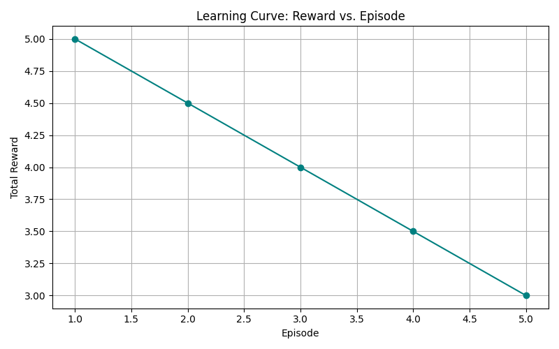
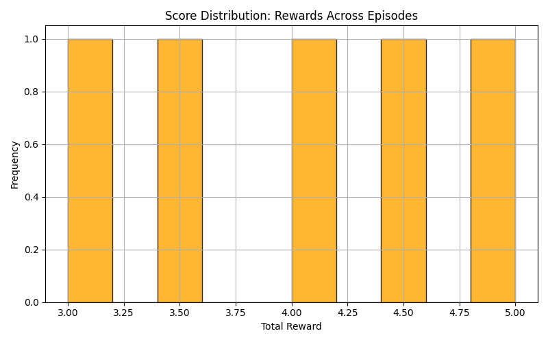
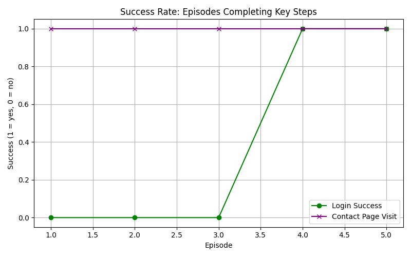

# Web Flow DRL Environment

This repository implements a **custom Gymnasium-compatible environment** imulating browser-based workflows such as login, navigation, and form submission on a sample website. Agents are trained using **PPO** and **A2C** to autonomously perform multi-step web interactions.

---

## Contributors

| Name             | Role / Contribution                  |
|------------------|-------------------------------------|
| **Hailey D'souza** | Lead Developer |
|  **Sammak Ahmed**| Developer |

## Project Structure

```

project_root/
│
├─ envs/                # Custom environment wrappers
│   └─ web_flow_env.py
│
├─ src/                # Training / evaluation / gameplay scripts
│   ├─ eval_web.py
│   ├─ graphs.py
│   └─ training_web.py
│
├─ web_app/ # Local test web app templates
│ ├─ templates/
│ │ ├─ index.html
│ │ ├─ login.html
│ │ ├─ navbar.html
│ │ ├─ contact.html
│ │ └─ dashboard.html
│ └─ server.py
│
├─ models/webflow/ # Saved PPO agent, created automatically during testing,demonstrates reproducibility and file structure
├─ logs/  # Training and evaluation logs 
├─ configs/ # YAML configs for algorithms, rewards, seeds, personas
├─ requirements.txt
└─ README.md

````

---

## Setup

1. Ensure Python 3.9+ is installed.
2. Install dependencies:

```bash
pip install -r requirements.txt
````
or create a virtual environment:

```bash
python3 -m venv .venv && source .venv/bin/activate
pip install --upgrade pip
pip install -r requirements.txt
```
---

## 🖥️ Running the Project

This setup requires **two active terminals** running concurrently:

### **Terminal 1 – Start the Web Server**

Run the Flask web app (this must stay active while training or evaluation runs):

```bash
python server.py
```

This starts a local web server at `http://127.0.0.1:5000`, which the DRL agent interacts with through Selenium.

---

### **Terminal 2 

## Training an Agent

Use src/training_web.py to train a PPO or A2C model on the WebFlowEnv.

### CLI Arguments

| Argument           | Description                                        | Default          |
| ------------------ | -------------------------------------------------- | ---------------- |
| `--algo`           | RL algorithm: `ppo` or `a2c`                       | `ppo`            |
| `--timesteps`      | Total training timesteps                           | `8000`           |
| `--seed`           | Random seed for reproducibility                    | `42`             |
| `--persona`        |Agent persona `form_filler or explorer`             | `form_filler`    |

### Examples

Train a PPO model with for form-filling tasks:

```bash
python -m src.training_web --algo ppo --persona form_filler --timesteps 8000
```

Train an A2C agent for exploration tasks:

```bash
python -m src.training_web --algo a2c --persona explorer --timesteps 5000
```

---

## Evaluating a Model

Evaluate a trained model and log metrics using src/eval_web.py.

### CLI Arguments

| Argument           | Description                            | Default                 |
| ------------------ | -------------------------------------- | ----------------------- |
| `--algo`           | Algorithm type: `ppo` or `a2c`         | `ppo`                   |
| `--model_path`     | Path to the saved model                | *required*              |
| `--episodes`       | Number of evaluation episodes          | `5`                    |
| `--persona`        | Reward persona used for evaluation     | `form_filler`            |

### Examples

Evaluate a PPO model visually:

```bash
python -m src.eval_web --algo ppo --model_path models/webflow/ppo_formfiller_final.zip --episodes 5
```

If the trained model file is missing, the script automatically generates **dummy evaluation data** in:
```
logs/ppo_formfiller_eval.csv
```

---

## Visualization and Metrics

Use `src/graph_results.py` to visualize training results and evaluation metrics.

```bash
python -m src.graph_results
```

### Outputs

| File | Description |
|------|--------------|
| `logs/ppo_formfiller_eval.csv` | Episode-level metrics |
| `logs/reward_vs_episode.png` | Reward progression plot |

---

## Environment Details

### Actions

| Action | Description |
|--------|--------------|
| `0` | Click next / proceed |
| `1` | Fill form input |
| `2` | Submit form |
| `3` | Navigate to next page |

### Observations

Each observation represents a simplified web state (page progress, form completion, and navigation success indicators).


---

## Reward Structure

| Event | Reward |
|--------|---------|
| Successful login | `+10` |
| Correct form input | `+5` |
| Navigation to contact page | `+8` |
| Repeated failure | `-2` |
| Timeout | `-5` |

---

## Metrics Collected

The evaluation script logs:
- Total reward per episode  
- Login success rate  
- Contact page visit success  
- Steps taken  
- Time elapsed  

---

## Example Results

**Reward Curve:**  
<p align="center">
  
</p>

**Score Distributions:** 
<p align="center">
   
</p>

**Success Rate Analysis:**
<p align="center">
   
</p>

**Evaluation CSV Preview:**  
| Episode | Total Reward | Login Success | Contact Visit | Steps | Time Elapsed |
|----------|---------------|----------------|----------------|---------|---------------|
| 1 | 12.0 | 1 | 1 | 15 | 18.2 |
| 2 | 9.5 | 1 | 0 | 12 | 14.6 |

---

## Demo Run

### Visualization


After setup, run:
```bash
python -m src.training_web
python -m src.eval_web
python -m src.graph_results
```

Expected outputs:
- ✅ Automated Chrome browser interaction  
- ✅ Evaluation CSV with metrics  
- ✅ Reward vs Episode graph in `logs/`

---

## Notes & Best Practices

* ✅ Compatible with headless browser automation (Selenium + Gymnasium)  
* ✅ Uses PPO and A2C algorithms from Stable-Baselines3  
* ✅ CSV + PNG outputs for report submission  
* ✅ Dummy model/eval fallback for reproducibility  
* ❌ Long training times if timesteps > 5000  
* ❌ Browser window may freeze if not headless  

---


